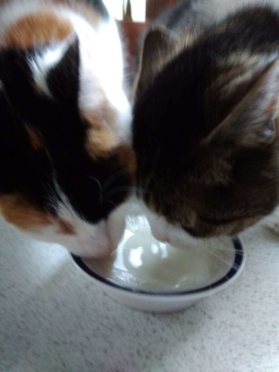

# A3 SPA

This is a personal web desktop single page application (PWD SPA). It's basically a desktop in a browser. 

It has 3 applications:
- a memory game
- web socket based chat
- a snake game

## How to download/start
Prerequisites: npm

1. Download the repository.
2. Install prerequisites by running `npm install` while in the directory.
2. Run `npm run serve` while in the directory to be able to access the website via browser. Use the IP address you can see in the terminal.
3. Run `npm run ws-start` to enable chat communications by opening a socket.
4. Access website hosted locally via browser.

>If you somehow lose `dist` directory or it's missing for unknown reasons, you can rebuild the code with `npm run build`

## Linters

You can use linters by running `npm run lint` while in the directory. They will show you whatever errors the code might have.